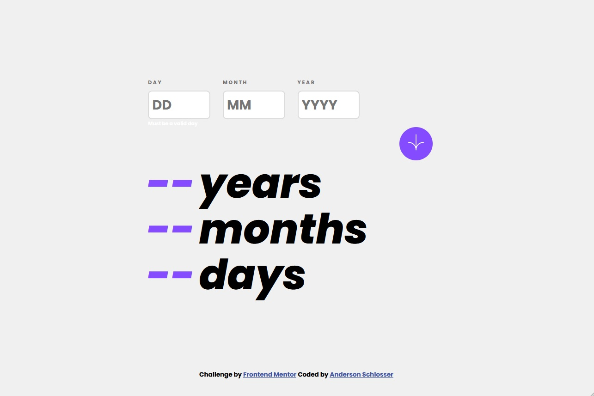
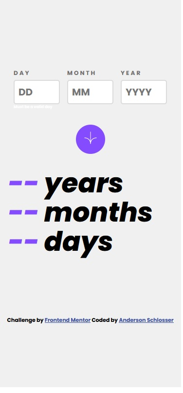
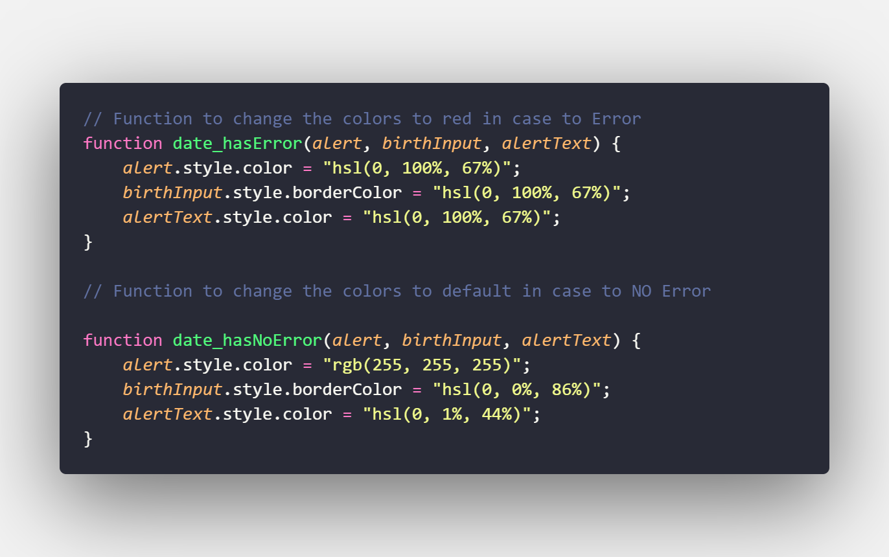

# Frontend Mentor - Age calculator app solution

This is a solution to the [Age calculator app challenge on Frontend Mentor](https://www.frontendmentor.io/challenges/age-calculator-app-dF9DFFpj-Q). Frontend Mentor challenges help you improve your coding skills by building realistic projects. 

## Table of contents

- [Overview](#overview)
  - [The challenge](#the-challenge)
  - [Screenshot](#screenshot)
  - [Links](#links)
- [My process](#my-process)
  - [Built with](#built-with)
  - [What I learned](#what-i-learned)
  - [Continued development](#continued-development)
  - [Useful resources](#useful-resources)
- [Author](#author)

**Note: Delete this note and update the table of contents based on what sections you keep.**

## Overview

### The challenge

Users should be able to:

- View an age in years, months, and days after submitting a valid date through the form
- Receive validation errors if:
  - Any field is empty when the form is submitted
  - The day number is not between 1-31
  - The month number is not between 1-12
  - The year is in the future
  - The date is invalid e.g. 31/04/1991 (there are 30 days in April)
- View the optimal layout for the interface depending on their device's screen size
- See hover and focus states for all interactive elements on the page
- **Bonus**: See the age numbers animate to their final number when the form is submitted

### Screenshot
 <h3>Solutin Desktop</h3>

  

  <h3>Solutin Mobile</h3>

  

### Links

- Solution URL: [https://github.com/andyzaum/age-calculator-app-main](https://github.com/andyzaum/age-calculator-app-main)
- Live Site URL: [Add live site URL here](https://your-live-site-url.com)

## My process

### Built with

- Semantic HTML5 markup
- CSS custom properties
- Flexbox
- CSS Grid
- Mobile-first workflow
- JavaScript
- [Sass](https://sass-lang.com/)

### What I learned

In this project, I was able to enhance my knowledge of JavaScript, learning to use logic operators more effectively and various other functionalities. The entire script is commented to describe the functions of each validator!

Im proud of this code from JS 🎉:

In this code, I created a function that would change the colors of the inputs and texts to red in case of an error and remove them if there were no errors. I better understood the concept of parameters and how to provide them only when using the function!

### Continued development

I still have some difficulties in JS, but nothing that prevents me from building large projects. The validators were a challenge for me, while CSS I had almost no difficulty with, it being a very enjoyable part for me.

### Useful resources

- [Sass](https://sass-lang.com/) - Sass is a great ally when it comes to styling your projects, along with the 'Live Server' extension greatly improving the organization, understanding, and functionality of my project. It is simple and easy to use, requiring only the 'Live Sass' extension in VSCode.

## Author

- Frontend Mentor - [@andyzaum](https://www.frontendmentor.io/profile/andyzaum)
- Github - [@andyzaum](https://www.twitter.com/yourusername)
- Instagram - [@eu.schlosser](https://www.instagram.com/eu.schlosser/)

